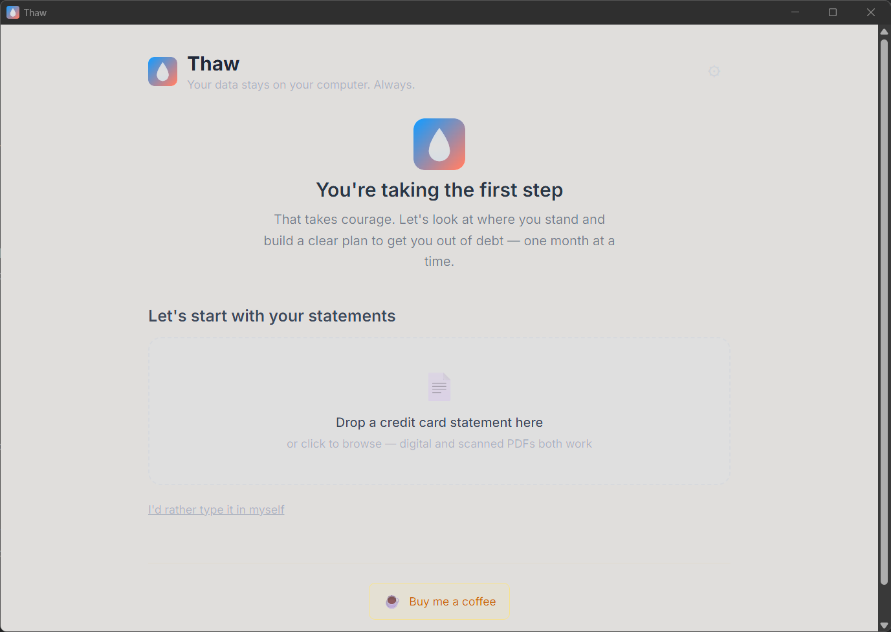

<p align="center">
  
</p>

<h1 align="center">Thaw</h1>

<p align="center">
  <strong>Drowning in credit card debt? Thaw it out.</strong><br/>
  Upload your statements or type in your balances, set a budget, and get a clear month-by-month plan to become debt-free.
</p>

<p align="center">
  <a href="https://github.com/LordVelm/thaw/releases/latest"></a>
  <a href="https://github.com/LordVelm/thaw/blob/master/LICENSE"></a>
  
  
  
</p>

---

<!-- Add screenshots here after taking them:
<p align="center">
  
</p>
<p align="center">
  
</p>
-->

## Features

- **PDF statement extraction** with local AI (Qwen2.5-3B via llama-server, no cloud)
- **Manual entry** with multi-tier balance support (promo APR + standard APR)
- **Budget calculator** with income/expense breakdown
- **Avalanche vs Snowball** strategy comparison with month-by-month schedule
- **GPU acceleration** with NVIDIA CUDA auto-detection, CPU fallback

Your data stays on your computer. Always.

## Tech Stack

| Layer | Technology |
|-------|-----------|
| Desktop | Tauri v2 + React 19 + TypeScript + Vite |
| Styling | Tailwind CSS |
| Backend | Rust (Tauri commands, SQLite, LLM management) |
| AI | llama.cpp (bundled, runs locally) + pdfjs-dist + Tesseract.js |
| Math | Deterministic payoff engine with CARD Act tier-aware payment allocation |

## Development

```bash
npm install
cd apps/desktop
npx tauri dev
```

## License

MIT
